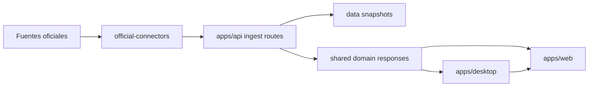

# Arquitectura de EspañaIA

## Objetivo de esta fase

Convertir el blueprint en una base de producto donde frontend, API, ingestión, desktop y dominio compartido evolucionen sobre la misma estructura desde el primer día.

## Capas ya implementadas

### Web

- Home principal con estética AI/signal intelligence.
- Directorios navegables para territorios, partidos y políticos.
- Páginas de detalle conectadas entre sí mediante el grafo seed actual.
- Diseño responsive preparado para desktop y móvil.

### API

- Servicio dedicado en Fastify dentro de `apps/api`.
- Endpoints de consulta para entidades, señales, presupuestos y conectores.
- Rutas de ingestión manual para BOE, Congreso, Senado y censo político unificado.
- Persistencia de snapshots descargados en `data/ingestion` o en la carpeta local del usuario cuando corre en desktop.

### Desktop

- Packaging desktop en `apps/desktop`.
- Shell macOS nativa en `apps/macos-native`.
- Ventana nativa con arranque coordinado de web y API.
- Packaging local a `.app` con runtime preparado desde el monorepo.

### Dominio compartido

- `shared-types` centraliza contratos de territorios, partidos, políticos, señales, presupuestos e ingestión.
- `seed-data` aporta datasets iniciales y helpers reutilizables para web y API.
- `official-connectors` encapsula fetch, descubrimiento y normalización inicial de fuentes oficiales.

### Persistencia

- Primer esquema PostgreSQL en `apps/api/db/schema.sql`.
- Tablas para territorios, instituciones, partidos, políticos, roles, artículos, BOE, presupuestos, iniciativas, menciones, alertas, usuarios e ingestión.
- Índices orientados a búsquedas por entidad, tiempo y trazabilidad.

## Fuentes oficiales conectadas

- BOE Open Data mediante sumario diario en JSON.
- BORME Open Data mediante sumario diario en JSON/XML y enlaces a PDF, HTML y XML.
- Congreso Open Data con descubrimiento de feeds HTML y descarga de diputados activos y proyectos de ley.
- Senado Open Data con composición actual, grupos parlamentarios y resolución del directorio de senadores.

## Ingestión por capas

1. Congreso: live.
   Directorio oficial de diputados activos y capa parlamentaria del Congreso.
2. Senado: live.
   Directorio oficial de senadores activos, grupos y procedencia electa o designada.
3. Parlamentos autonómicos: planned.
   Siguiente expansión con conectores por cámara autonómica y legislatura.
4. Administración local: planned.
   Fase posterior para alcaldías, concejalías, diputaciones, cabildos y consells.

## Flujo actual

## Estado actual frente al roadmap

1. API dedicada: lista.
2. Esquema PostgreSQL inicial: listo.
3. Conectores oficiales BOE, BORME, Congreso y Senado: listos en primera versión.
4. Censo parlamentario oficial unificado: listo para Congreso y Senado.
5. Navegación por territorio, partido y político: lista.
6. App macOS local: lista.
7. Persistencia real y jobs incrementales: siguiente paso.

## Siguiente iteración recomendada

1. Conectar PostgreSQL real a la API y migrar parte del seed al almacenamiento persistente.
2. Añadir workers de ingestión programada, deduplicación y entity resolution.
3. Expandir conectores hacia parlamentos autonómicos, diarios oficiales y presupuestos territoriales.
4. Añadir icono nativo, firma y notarización para distribución macOS.
5. Incorporar scoring, alertas y búsqueda semántica sobre entidades y documentos.

## Principios de diseño

- Trazabilidad visible por diseño.
- Separación clara entre presentación, conectores, desktop y dominio.
- Capacidad de crecer hacia workers, alertas y multiusuario sin rehacer la base.
